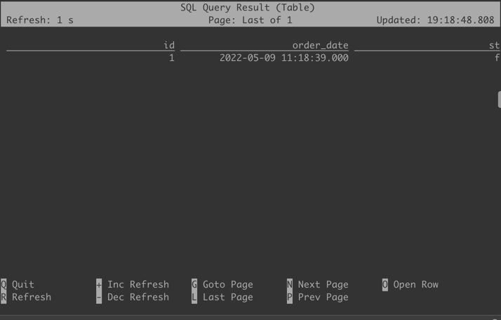

# StarRocks Flink connector
StarRocks is an MPP online analytical processing (OLAP) database. StarRocks Flink connector is released to allow user
seamlessly sync data from and to Flink. In this demo, we sync data from TIDB to StarRocks using the Tidb and StarRocks Flink-connector.
## TIDB
### Download TiDB
Get TiDB installation package`tidb-community-server-v4.0.9-linux-amd64.tar.gz` from
[here](https://download.pingcap.org/tidb-community-server-v4.0.9-linux-amd64.tar.gz).
### Install TiDB
```bash
tar -xvf tidb-community-server-v4.0.9-linux-amd64.tar.gz
cd tidb-community-server-v4.0.9-linux-amd64
sh local_install.sh
```
Once installed, you should see the installed path:
```plaintext
Installed path: /.../$USERNAME/.tiup/bin/tiup
```
For simplicity, we use TiDB playground to deploy a single node test environment:
```commandline
cd /.../$USERNAME/.tiup/bin/
tiup playground
```
You should see:
```plaintext
CLUSTER START SUCCESSFULLY, Enjoy it ^-^
To connect TiDB: mysql --host 127.0.0.1 --port 4000 -u root
To view the dashboard: http://127.0.0.1:2379/dashboard
To view the Prometheus: http://127.0.0.1:9090
To view the Grafana: http://127.0.0.1:3000
```
### Create a TiDB table
Use mysql to connect:
```commandline
mysql --host 127.0.0.1 --port 4000 -u root
```
For simplicity, we are only going to create a table with 3 columns, id (primary key), order_date and status.
```sql
Create table test_db (
id INT,
order_date timestamp(3),
status boolean,
primary key(id));
```

## Flink
## Install & Deploy
To run flink, make sure that you have Java 8 or 11 installed. Detailed installation guide [here](https://nightlies.apache.org/flink/flink-docs-release-1.13/docs/try-flink/local_installation/)
After downloading the binaries, enter the dir `cd flink-1.13.6` and start the cluster with local mode (use local compute resource).

As default, Flink only uses 1Gb of RAM and 1 core. We can configure it according to this [documentation](https://nightlies.apache.org/flink/flink-docs-master/zh/docs/deployment/config/)
```bash
./bin/start-cluster.sh
```
You should see:
```plaintext
Starting cluster.
Starting standalonesession daemon on host.
Starting taskexecutor daemon on host.
```
To start the flink commandline tool, run:
```bash
./bin/sql-client.sh
```
### Download Flink Connectors
Download TiDB Flink connector.
```bash
wget https://repo1.maven.org/maven2/com/ververica/flink-sql-connector-tidb-cdc/2.2.0/flink-sql-connector-tidb-cdc-2.2.0.jar
```
Download [StarRocks FLink connector](https://github.com/StarRocks/flink-connector-starrocks)
Put both `*.jar` files in `/flink/flink-1.13.6/lib` dir.
### Create necessary Flink tables
Create a table to sink update from TiDB using TiDB-Flink-connector.
```sql
Create table test_db (
  id INT, 
  order_date timestamp(3), 
  status boolean, 
  primary key(id) not enforced
) WITH (
  'connector' = 'tidb-cdc', 'tikv.grpc.timeout_in_ms' = '20000', 
  'pd-addresses' = 'localhost:2379', 
  'database-name' = 'test', 'table-name' = 'test_db'
);
```

Create a table to send data to StarRocks using StarRocks-Flink-connector.
```sql
Create table test_db_sink (
  id INT, 
  order_date timestamp(3), 
  status boolean, 
  primary key(id) not enforced
) with (
  'load-url' = '172.26.92.139:8039', 'sink.buffer-flush.interval-ms' = '15000', 
  'sink.properties.row_delimiter' = '\x02', 
  'sink.properties.column_separator' = '\x01', 
  'connector' = 'starrocks', 'database-name' = 'test', 
  'table-name' = 'test_db', 'jdbc-url' = 'jdbc:mysql://172.26.92.139:9039', 
  'password' = '', 'username' = 'root'
);
```


## StarRocks
### Installation & Deploy
Download the community version [here](https://www.starrocks.com/en-US/download/community).

Follow this [guide](https://docs.starrocks.com/en-us/main/quick_start/Deploy) to deploy.

### Create a StarRocks table
```sql
Create table test_db (
  id INT, order_date datetime, status boolean
) engine = olap primary key(`id`) DISTRIBUTED BY HASH(`id`) BUCKETS 1 PROPERTIES (
  "replication_num" = "3", "in_memory" = "false", 
  "storage_format" = "DEFAULT"
);
```

## Test
### TiDB to Flink
First we insert data into TiDB
```commandline
Insert into test_db values(1,now(),0)
```
In the Flink sql console, we then are able to see the row we inserted in TiDB.


### TiDB to StarRocks
Clear test_db and insert new data:
```sql
truncate table test_db;
Insert into test_db values(0,now(),0);
```
Check the inserted data:
```plaintext
mysql> select * from test_db;
+----+-------------------------+--------+
| id | order_date              | status |
+----+-------------------------+--------+
|  0 | 2022-05-09 20:09:32.000 |      0 |
+----+-------------------------+--------+
1 row in set (0.01 sec)
```
In Flink, copy data from test_db to test_db_sink.
```sql
insert into test_db_sink select * from test_db;
```
Output:
```plaintext
[INFO] Submitting SQL update statement to the cluster...
[INFO] SQL update statement has been successfully submitted to the cluster:
Job ID: dbfc9a92bb095bdaee9976758f9ad140
```
In StarRocks, refresh table and see the newly sync'd data.
```sql
select * from test_db;
```
```plaintext
+------+---------------------+--------+
| id   | order_date          | status |
+------+---------------------+--------+
|    0 | 2022-05-09 12:09:32 |      0 |
+------+---------------------+--------+
1 row in set (0.00 sec)
```
